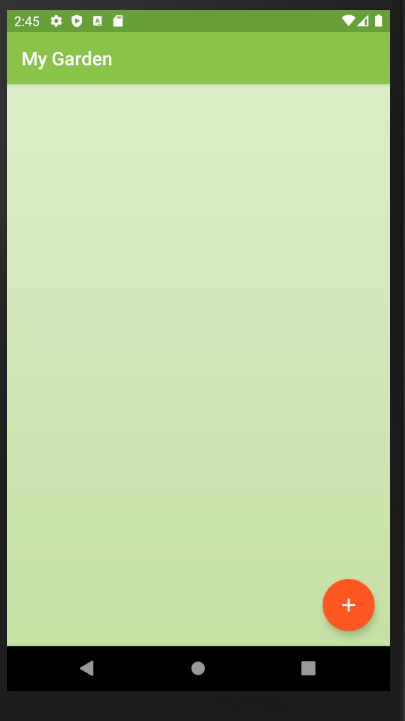
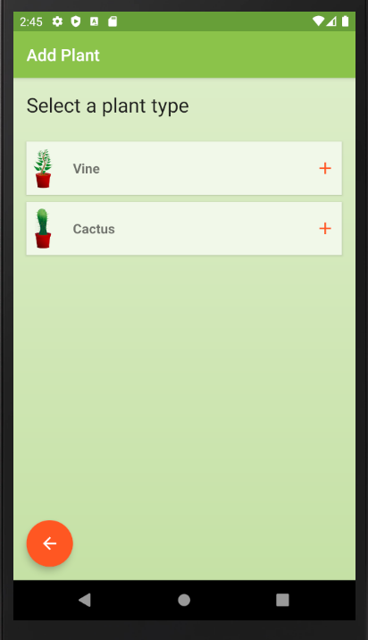
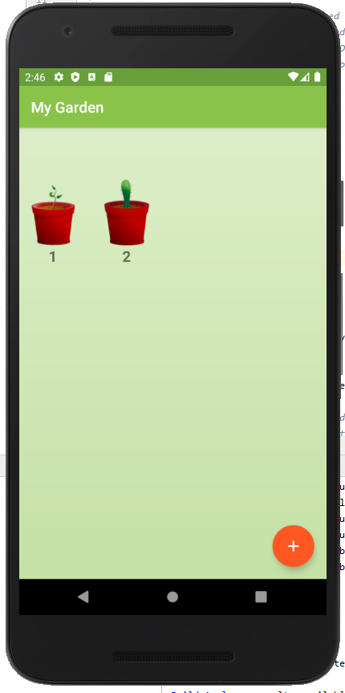
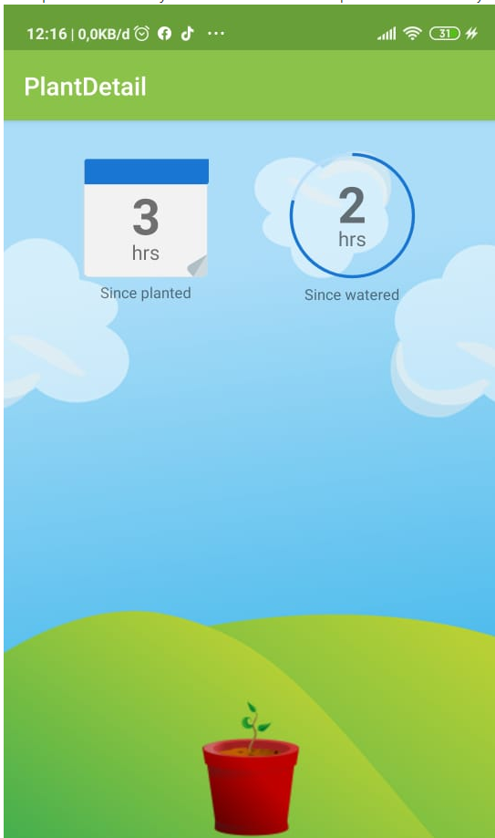
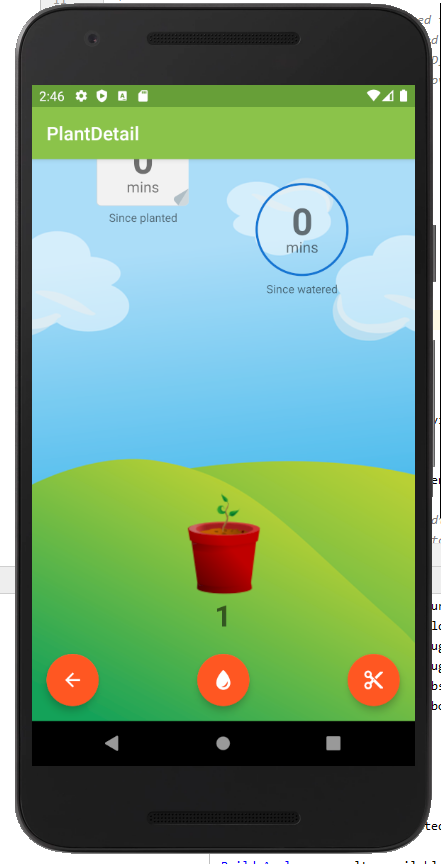
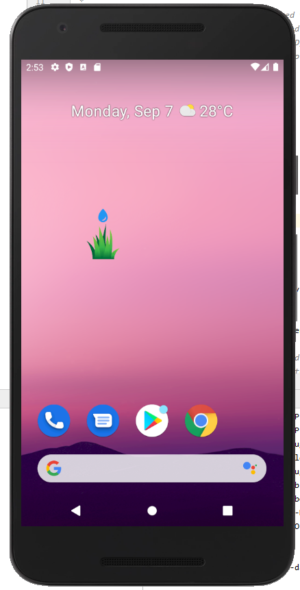
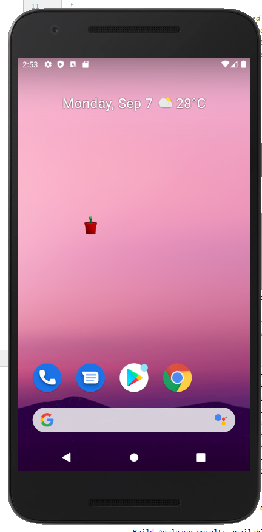
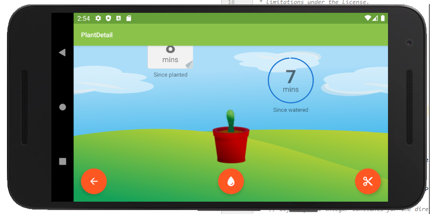

# my garden
My Garden adalah salah satu aplikasi yang dimana kita dapat merawat sebuah tanaman. Didalam aplikasi terdapat fitur widget yang dimana kita bisa menggunakan aplikasi ini tanpa harus membuka aplikasi yang asli. Dan di aplikasi ini kita bisa menyiram dan memotong tanaman yang kita miliki hingga tumbuh menjadi besar
# tampilan pertama sebelum diberi tanaman

# pilihan tumbuhan
disini kita disuruh memilih tanaman

# tampilan seteleh memilih

# tampilan sebelum disiram

# tampilan setelah disiram 

# widget butuh disiram

# widget setelah disiram

# tampilan miring

